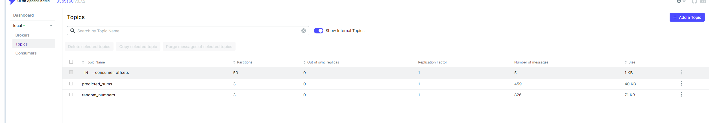
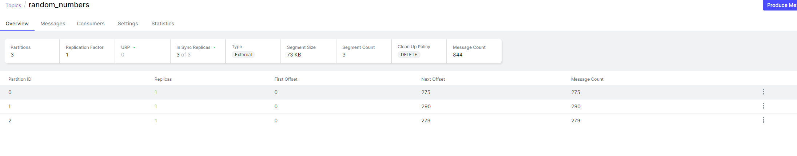
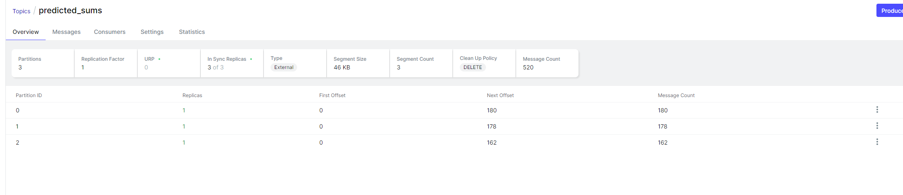
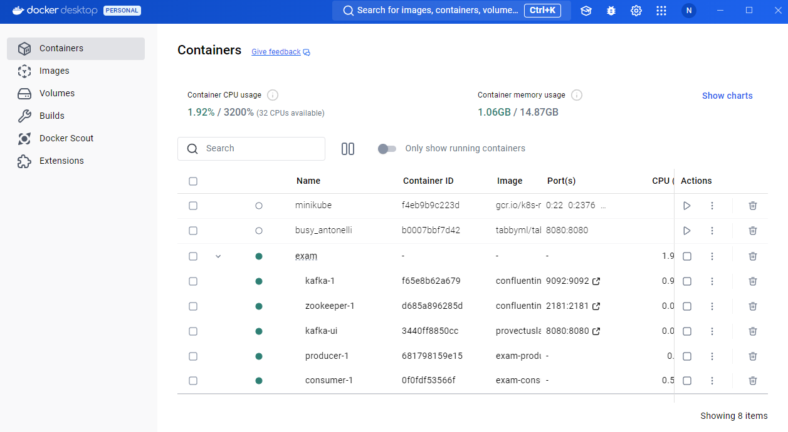
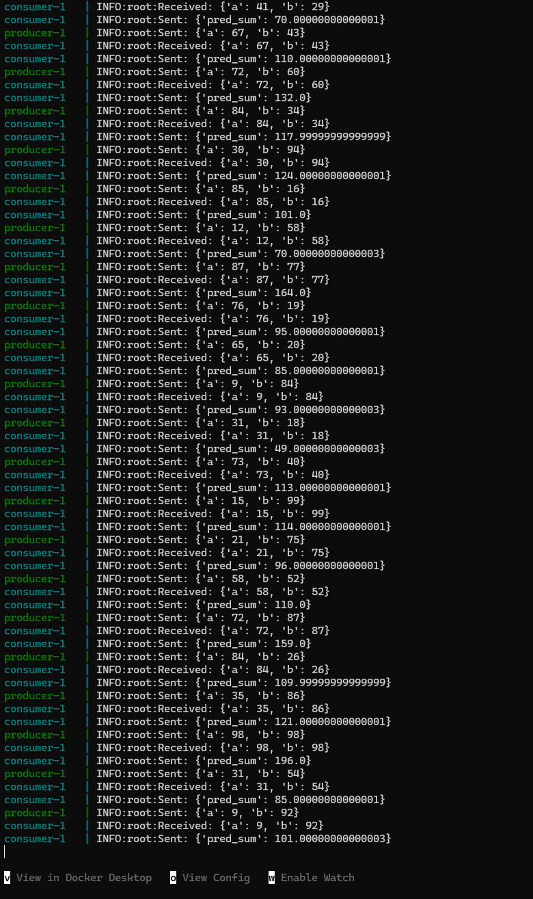

 # Задание 4. Продолжим работать с той же задачей. Реализуйте поток данных с Kafka для передачи случайно сгенерированных чисел:

1. Настройте Kafka: создайте тему (например, random_numbers) для передачи данных. 

2. Напишите Python-продюсер с использованием библиотеки Kafka-Python, который каждую секунду отправляет сообщение в Kafka-тему. Сообщение должно содержать два случайных числа от 0 до 100 в формате JSON.

3. Напишите Python-консюмер с использованием библиотеки Kafka, который читает эти сообщения в реальном времени и выводит их на экран.

4. Расширьте консюмер: интегрируйте переданную модель машинного обучения (из предыдущей задачи), чтобы консюмер получал из Kafka числа, вычислял их сумму с помощью модели и отправлял результат в новую Kafka-тему (например, predicted_sums).

Установка

1. Клонирование репозитория

git clone https://github.com/Niktyav/MLModel_in_prod
cd MLModel_in_prod/exam

2. Запуск Kafka локально через Docker Compose

docker-compose up -d

Topics:   
   

Topic "random_numbers" с 3 патрициями:   
   
Topic "predicted_sums" с 3 патрициями:   
   

Состояние docker-compose:
   
Состояние docker-compose:
   